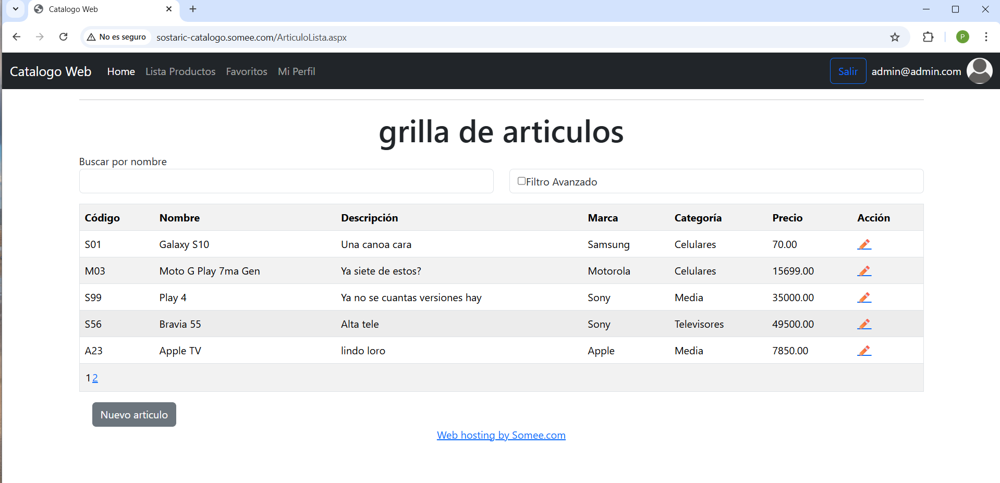
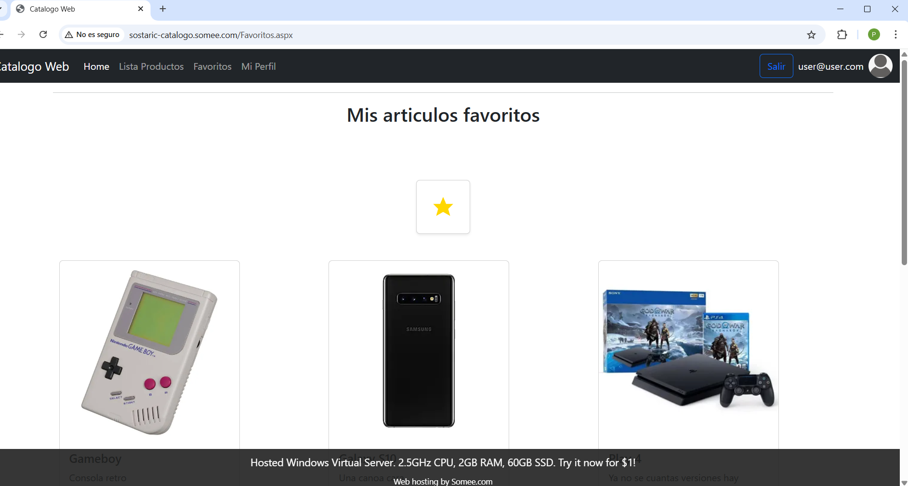
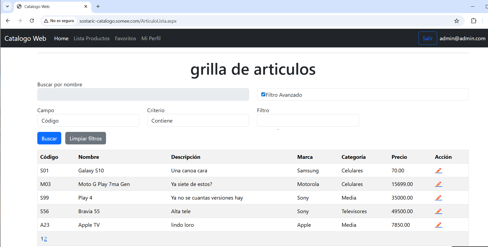
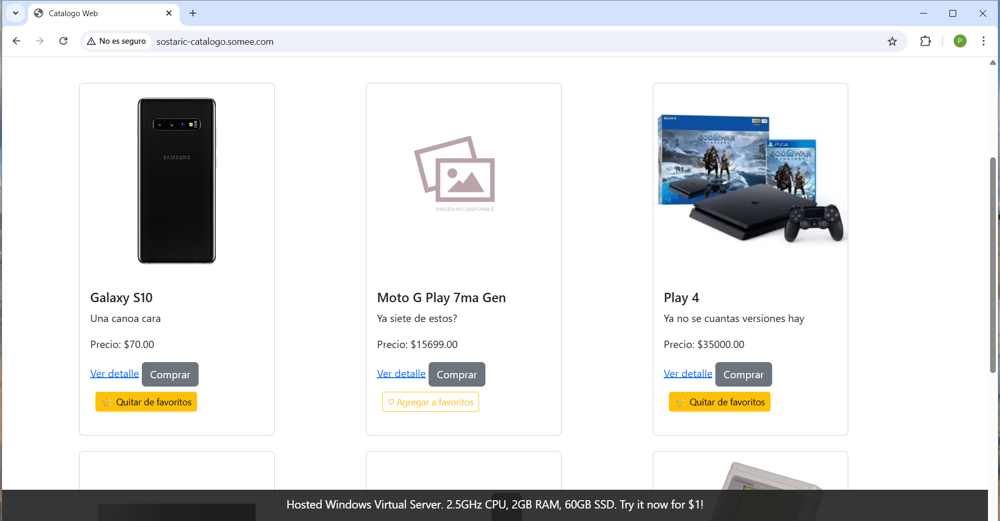
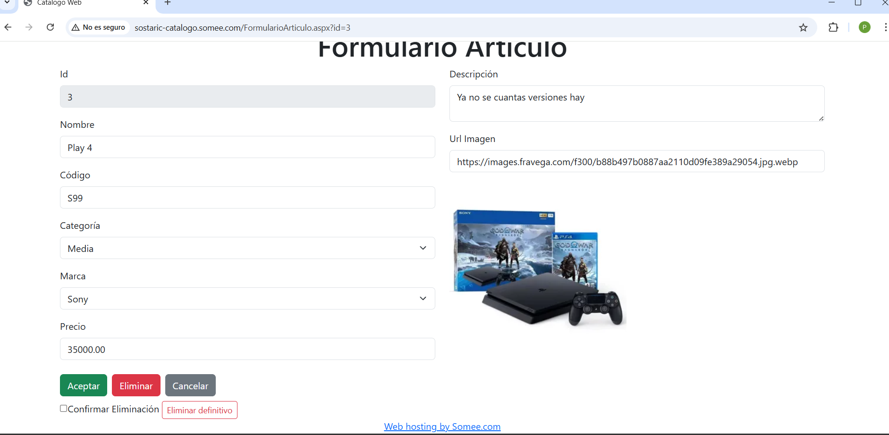

# TP Final Nivel 3 - Sostaric Patricio
🧩 Refactorización y Blindaje

Este proyecto fue desarrollado con **.NET Framework 4.8**, utilizando **ASP.NET WebForms**, **ADO.NET**, **SQL Server**, **CSS** y **Bootstrap** para el diseño y la experiencia de usuario.

Cada módulo fue ajustado y refactorizado para lograr una aplicación lista para evaluación profesional, defensiva y coherente.

---

## 🚀 Demo en vivo
La aplicación está publicada y disponible aquí:  
👉 [sostaric-catalogo.somee.com](http://sostaric-catalogo.somee.com/)

### 👥 Usuarios de prueba
**Admin**  
- Usuario: `admin@admin.com`  
- Contraseña: `admin`  

**Usuario común**  
- Usuario: `user@user.com`  
- Contraseña: `user`  

Además, cuenta con la funcionalidad para dar de alta usuarios nuevos.

---

## 📸 Capturas de pantalla
  
  
  
  
  

---

## 🔎 Filtros
**Filtro común (txtFiltro)**  
- Vacío → devuelve todos los artículos  
- Texto → filtra automáticamente por nombre  
- Mensajes claros y únicos para resultados vacíos o sesión caída  

**Filtro avanzado (chkFiltroAvanzado)**  
- Validaciones defensivas: campo vacío y precio inválido  
- Eliminada duplicación de mensajes con EmptyDataTemplate  
- Layout restaurado con proporciones originales y botones unificados  

---

## 🛡️ Validaciones
- Centralizadas en la helper estática `Validacion`  
- Reutilización en todas las páginas para coherencia y mantenibilidad  
- Mensajes consistentes en toda la aplicación  

---

## ⭐ Favoritos y Compras
- Lógica defensiva contra duplicados y sesiones nulas  
- Manejo de excepciones con redirección a `Error.aspx`  
- Encapsulación en métodos para claridad y orden  

---

## ⚙️ Tecnologías utilizadas
- .NET Framework 4.8  
- ASP.NET WebForms  
- ADO.NET  
- SQL Server  
- CSS  
- Bootstrap  
- LINQ  
- C#  
- Git/GitHub para control de versiones  

---

## 🎯 Estado del Proyecto
Este commit marca el blindaje definitivo del proyecto:  
- Filtros inteligentes y anti‑errores  
- Validaciones coherentes y centralizadas  
- Código limpio, refactorizado y defensivo  

---

## 🗄️ Base de Datos
- Carpeta: `Datos/Scripts/`  
- Script principal: `CatalogoDB.sql`  
- Motor: SQL Server  
- Incluye tablas: Artículos, Categorías, Marcas, Usuarios  
- Datos iniciales: categorías y marcas de prueba, artículos de ejemplo, usuarios admin y común  

---

## 🔮 Próximos pasos
Se iniciará la migración del proyecto a **.NET 9 MVC Core** con:  
- Entity Framework Core  
- Identity  
- LINQ  
- Inyección de dependencias  

El nuevo repositorio reflejará esta evolución tecnológica y quedará enlazado desde aquí.
